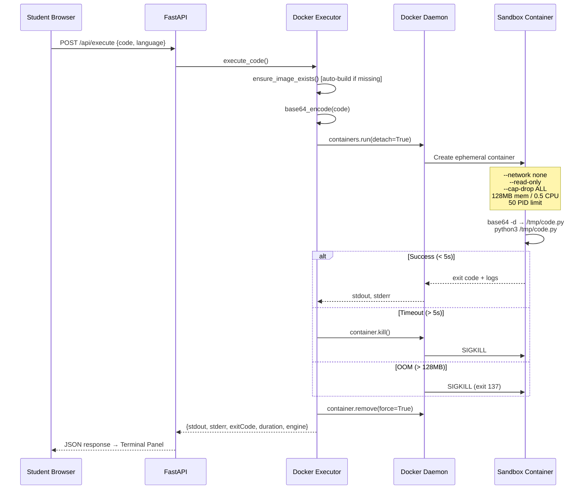

# CodeForge — Docker Execution Engine Upgrade

## What Changed

Replaced the subprocess fallback with a **Docker-primary execution engine** that runs all student code inside ephemeral, hardened containers.

---

## Execution Protocol



---

## Files Modified

### [config.py](file:///Users/rosh/Personal/Projects/SEProject/backend/config.py)

```diff
-DOCKER_ENABLED = os.getenv("DOCKER_ENABLED", "false").lower() == "true"
+DOCKER_ENABLED = os.getenv("DOCKER_ENABLED", "true").lower() == "true"
-DOCKER_TIMEOUT = int(os.getenv("DOCKER_TIMEOUT", "10"))
+DOCKER_TIMEOUT = int(os.getenv("DOCKER_TIMEOUT", "5"))  # 5 second strict timeout
+DOCKER_DOCKERFILE_PATH = os.getenv("DOCKER_DOCKERFILE_PATH", "docker/sandbox")
+MAX_OUTPUT_LENGTH = 10000  # chars
```

### [executor.py](file:///Users/rosh/Personal/Projects/SEProject/backend/docker/executor.py)

Complete rewrite with:
- **Docker-first routing** — subprocess only if Docker SDK unavailable
- **Auto-build** — `_ensure_image_exists()` builds from Dockerfile if image missing
- **Base64 code injection** — avoids shell escaping issues with heredocs
- **Compound command handling** — correctly handles `sh -c` for C++ compile+run
- **Async container lifecycle** — `run_in_executor()` for non-blocking Docker ops
- **Guaranteed cleanup** — `finally` block with `container.remove(force=True)`
- **OOM detection** — exit code 137 detected and reported with friendly message
- **Student-friendly errors** — paths cleaned (`/tmp/code.py` → `code.py`), actionable timeout tips

---

## Security Profile

| Constraint | Value | Purpose |
|-----------|-------|---------|
| `--network none` | Disabled | No internet access |
| `--read-only` | True | Root filesystem immutable |
| `--cap-drop ALL` | All dropped | No Linux capabilities |
| `--security-opt no-new-privileges` | Enabled | No privilege escalation |
| `--memory 128m` | 128 MB | Prevents memory bombs |
| `--cpus 0.5` | Half core | Prevents CPU hogging |
| `--pids-limit 50` | 50 processes | Prevents fork bombs |
| `tmpfs /tmp` | 64 MB | Writable scratch space (only) |
| `user=executor` | Unprivileged | Non-root execution |
| Timeout | 5 seconds | Kills infinite loops |
| Auto-remove | `container.remove(force=True)` | Zero disk bloat |

---

## Test Results

| Test | Status | Duration | Engine | Details |
|------|--------|----------|--------|---------|
| Python hello world | ✅ success | **138ms** | docker | `Python 3.11.15` on container `79161c63f039` |
| C++ compile+run | ✅ success | **389ms** | docker | g++ compiled and executed 5 iterations |
| Infinite `while True: pass` | ✅ timeout | **5116ms** | docker | Container killed, friendly error message |
| `ZeroDivisionError` | ✅ error | **108ms** | docker | Clean traceback with `code.py` (not `/tmp/code.py`) |
| Orphan containers after tests | **0** | — | — | `docker ps -a` shows zero sandbox containers |

---

## How to Verify

```bash
# Check Docker is running
docker version

# Verify sandbox image exists
docker images codeforge-sandbox

# Run the server
source venv/bin/activate
python3 -m uvicorn backend.main:app --reload --host 0.0.0.0 --port 8000

# Open http://localhost:8000 → Login → Write code → Click Run
# The terminal should show execution results from the Docker sandbox
```

> [!TIP]
> To disable Docker and fall back to subprocess, set `DOCKER_ENABLED=false` as an env var before starting the server.
